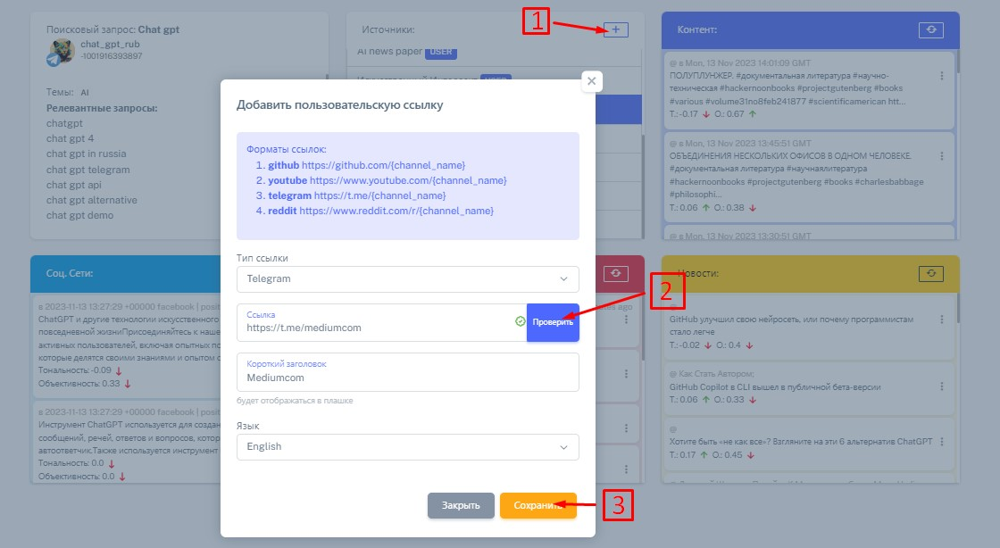

# 3. Пользовательские источники

1\) Для добавления источника необходимо нажать на плюс в информационном блоке "Источники"\
2\) Далее нужно выбрать тип источника и добавить ссылку источника, следуя формату показанному в информационном сообщении в верху всплывающего окна. Проверьте источник с помощью кнопки "проверить"\
3\) Убедившись, что введенные данные Вас устраивают и проверив их дополнительно. Необходимо нажать на кнопку сохранить.

<figure><figcaption></figcaption></figure>

Все! Новый "пользовательский" источник добавлен. Поздравляем!
