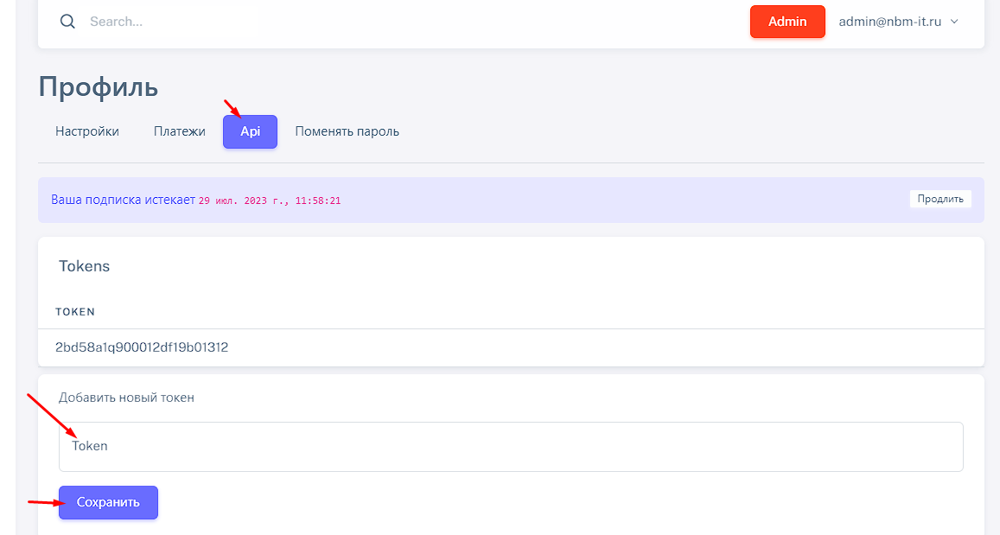

# 2.2 Экcпорт на сайт Wordpress


Данный раздел находится в разработке, в ближайшее время будет обновлен.


Переходим в раздел "профиль"

<figure><figcaption></figcaption></figure>

Переходим в раздел API и добавляем token, который Вам отдал плагин на Wordpress и нажимаем сохранить

<figure><figcaption></figcaption></figure>
